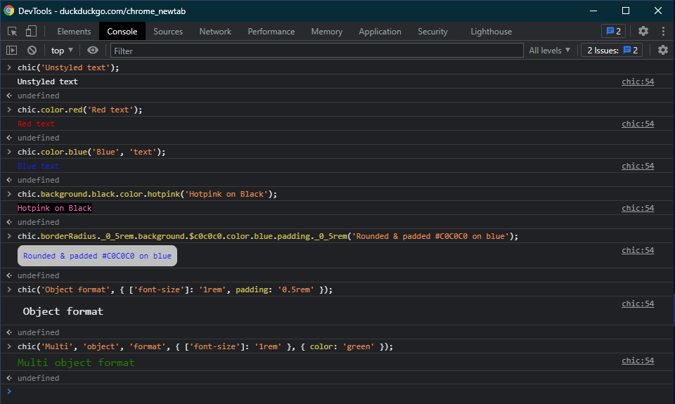
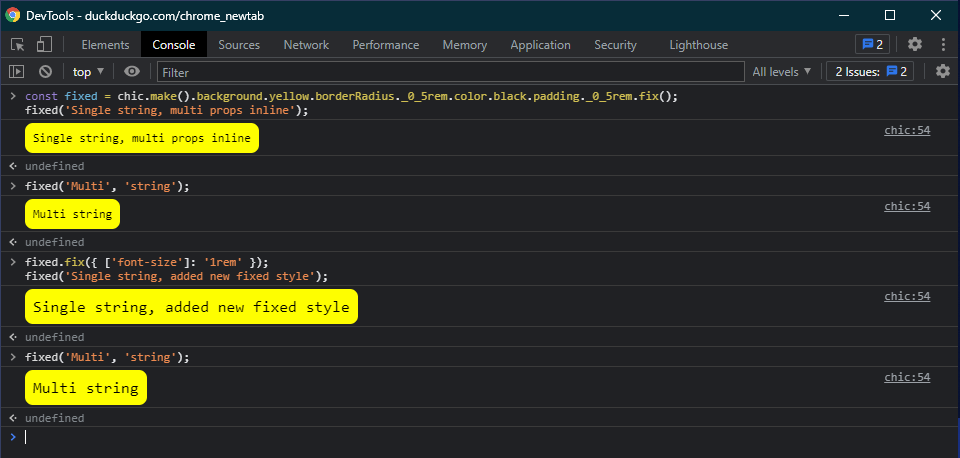
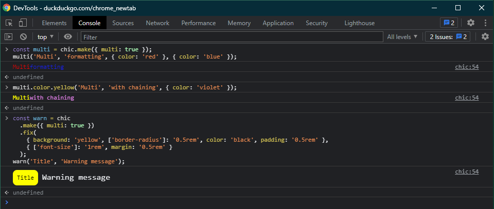

<!-- links -->

[webpack]: https://webpackjs.org
[rollup]: https://rollupjs.org
[snowpack]: https://snowpack.dev/
[vite]: https://vitejs.dev

<!--  -->

# chic

chic is a tiny assistant for helping make browser `console.log()` output prettier

## Getting Started

chic is meant to be used and viewed in the browser, and so it is assumed that you will either be importing directly from a CDN or using a bundler (such as [webpack]/[rollup]/[snowpack]/[vite]/...). We suggest a script tag with imports pointing to the CDN urls provided by jsdelivr:

```html
<!-- only use ONE of these import statements in your code! -->
<script type="module">
  import chic from 'https://cdn.jsdelivr.net/npm/@studiokeywi/chic/index.js'; // NPM mirror
  import chic from 'https://cdn.jsdelivr.net/gh/studiokeywi/chic/index.js'; // GitHub mirror
</script>
```

If you are using a bundler, then you can download and install via npm, and then import it at the top of your file(s):

`npm i -D @studiokeywi/chic`

```js
import chic from '@studiokeywi/chic';
```

## API

chic has two main modes for usage -- chainable and object configuration. Below are some examples showing both the syntax as well as the output:



### Chainable syntax

Behind the scenes, chic uses a JavaScript Proxy object to transform property values into CSS-friendly strings. Since CSS styles often require characters that are invalid in JavaScript identifiers, there are two options available. The first is to use bracket notation for property access:

```js
chic.background['#c0c0c0']['border-radius']['0.5rem']('Rounded corners on silver background');
```

The second is to use special replacement characters as described in this chart:

| Special Character       | Replacement              |
| ----------------------- | ------------------------ |
| $                       | #                        |
| \_ (at start of string) | (empty string)           |
| \_ (in between digits)  | .                        |
| sampleText (camel case) | sample-text (kebab case) |

```js
chic.background.#c0c0c0.borderRadius._0_5rem('Rounded corners on silver background');
```

### Configuration Object syntax

You can also pass in an object whose properties and values will become mapped into CSS strings:

```js
chic('Rounded corners on silver background', { background: '#c0c0c0', ['border-radius']: '0.5rem' });
```

### Style fixing

As seen in the screenshot above, repeated use of chic will clear styles in between usage, but sometimes you may want to build up a portion of styling that will always apply. This can be done with a combination of the `.make()` and `.fix()` functions. `.make()` will return a new instance of chic (and it is **strongly recommended** that you `.make()` a new instance before using `.fix()` to prevent styling from being applied to the default chic instance, unless that is your intent). `.fix()` saves any currently pending styles separately from any currently pending styles and supports taking in an configuration object to apply additional styles:



### Multiple style mode

The browser `console.log` method not only supports styling a single string, but supports providing multiple styles to multiple strings. This functionality can be used by passing in a configuration object to the `.make()` function that provides a truthy value for the property `multi`:


